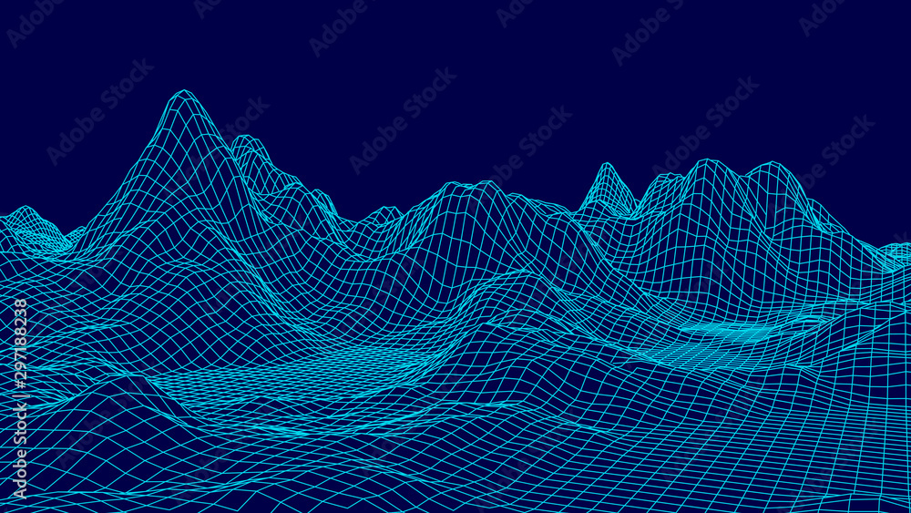
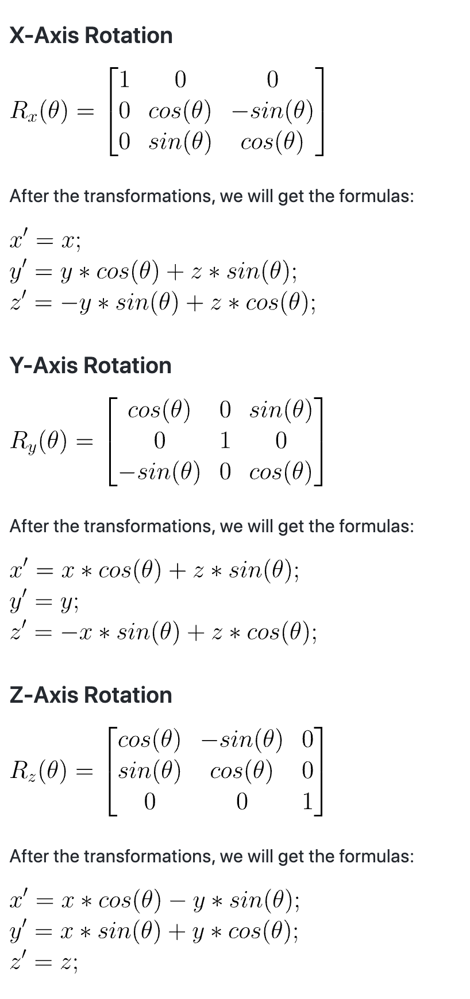

⋮⋮⋮⋮⋮⋮⋮⋮⋮⋮⋮⋮⋮⋮⋮⋮⋮⋮⋮⋮⋮⋮⋮⋮⋮⋮⋮⋮⋮⋮⋮⋮⋮⋮⋮⋮⋮⋮⋮⋮⋮⋮⋮⋮⋮⋮⋮⋮⋮⋮⋮⋮⋮⋮⋮⋮⋮⋮⋮⋮⋮⋮⋮⋮  
⋰⋰⋰⋰⋰⋰⋰⋰⋰⋰⋰⋰⋰⋰⋰⋰⋰⋰⋰⋰⋰⋰⋰⋰⋰⋰⋰⋰  
∷∷∷∷∷∷∷∷∷∷∷∷∷∷∷∷∷∷∷∷∷∷∷∷∷∷∷∷∷∷∷∷∷∷∷∷∷∷∷∷∷∷∷∷  
     wireframe model landscape in progress  
∷∷∷∷∷∷∷∷∷∷∷∷∷∷∷∷∷∷∷∷∷∷∷∷∷∷∷∷∷∷∷∷∷∷∷∷∷∷∷∷∷∷∷∷  
⋰⋰⋰⋰⋰⋰⋰⋰⋰⋰⋰⋰⋰⋰⋰⋰⋰⋰⋰⋰⋰⋰⋰⋰⋰⋰⋰⋰  
⋮⋮⋮⋮⋮⋮⋮⋮⋮⋮⋮⋮⋮⋮⋮⋮⋮⋮⋮⋮⋮⋮⋮⋮⋮⋮⋮⋮⋮⋮⋮⋮⋮⋮⋮⋮⋮⋮⋮⋮⋮⋮⋮⋮⋮⋮⋮⋮⋮⋮⋮⋮⋮⋮⋮⋮⋮⋮⋮⋮⋮⋮⋮⋮  
  
     👩🏻‍🎨 👩🏻‍💻 🕸 🏸 🥅 🚧 🏗  

## STAPPENPLAN:  
- miniLibX clonen en werkend krijgen  
- input parsen  
- miniLibX onderzoeken (sparksessie?)  
- https://www.khanacademy.org/computing/computer-programming/programming-games-visualizations/programming-3d-shapes/a/creating-3d-shapes  
- describing 3D shapes  
- drawing 3D shapes  
- rotating 3D shapes  
- https://github.com/VBrazhnik/FdF/wiki 
- https://git.42l.fr/Fabien/fdf 
- isometric transformations uitzoeken  
- sin tan cos uitzoeken  
- drawing a line uitzoeken 
- raster tekenen  
- data punten draaien  
- code slayen  
  
### Opdracht:  
- Your program has to display the image in a window.  
- The management of your window must remain smooth  
(changing to another window, minimizing, and so forth).  
- Pressing ESC must close the window and quit the program in a clean way.  
- Clicking on the cross on the window’s frame must close the window  
and quit the program in a clean way.  
  
  
  
- struct met x, y, z  
- voor elk data punt een struct aanmaken  
- elk struct in een array zetten  
- OF: map lezen als string, splitten op spatie  
- x = hoeveelste "woord" per lijn  
- y = hoeveelste rij = \n tellen  
- z = inhoud van nummer  
  

## TO DO:  
- make edit_data_points universal for every map (space between data points)  
- centering grid in middle of image  
- coloring for z-value: https://github.com/codam-coding-college/MLX42/wiki/Colors

# Facts  
Isometric projection is a method for visually representing three-dimensional  
objects in two dimensions in technical and engineering drawings. It is an   
axonometric projection in which the three coordinate axes appear equally   
foreshortened and the angle between any two of them is 120 degrees.  
The term "isometric" comes from the Greek for "equal measure",   
reflecting that the scale along each axis of the projection is the same.  
True isometric projection uses a 30° angle (0.523599 rad).  

Representative Scale (RF) = iso length / true length  
RF = cos(45)/cos(30)  
So, iso lengths = 0.82 x true lengths  

#### OLD MATH:
int	i;  
int old_x;  
int old_y;  
int	z;  
double degree;  
  
i = 0;  
degree = 45.0;  
add_spacing(map_data);  
while (i < map_data->amount_of_points)   
{   
     map_data->data_points[i].x *= 10;  
     map_data->data_points[i].y *= 10;  
     old_x = map_data->data_points[i].x;  
     old_y = map_data->data_points[i].y;  
     z = map_data->data_points[i].z;  
     map_data->data_points[i].x = ((old_x - old_y) * cos(rad))* 10;  
     map_data->data_points[i].y = (-z + (old_x + old_y) * sin(rad)) * 10;  
  
     // OF:  
     // map_data->data_points[i].x = ((old_x * cos(rad)) - (old_y * sin(rad))) * 10;  
     // map_data->data_points[i].y = (-z + (old_x * sin(rad)) + (old_y * cos(rad))) * 10;  
  
     // OF:  
     // map_data->data_points[i].x = ((old_x - old_y) * cos(rad))* 10;  
     // map_data->data_points[i].y = ((old_x * sin(rad)) + (old_y * cos(rad)));  
     // map_data->data_points[i].y = ((map_data->data_points[i].y * cos(rad)) - (z * sin(rad)))* 10;  
     i++;  
}  
  
# continue:  
https://www.youtube.com/watch?v=vlZFSzCIwoc  
https://www.youtube.com/watch?v=RGB-wlatStc  
https://en.wikipedia.org/wiki/Bresenham%27s_line_algorithm  