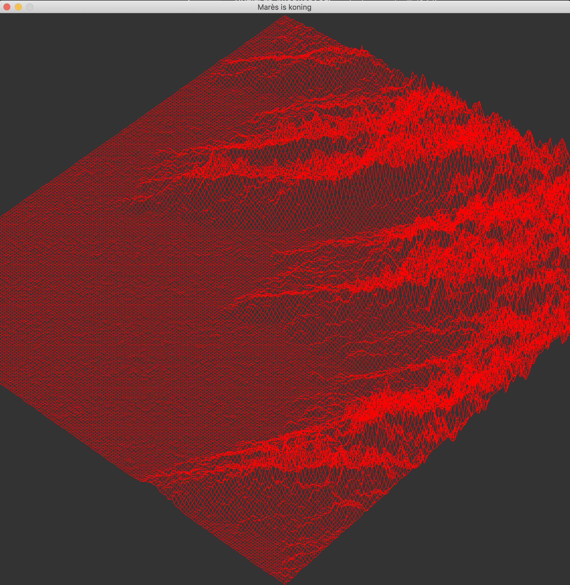
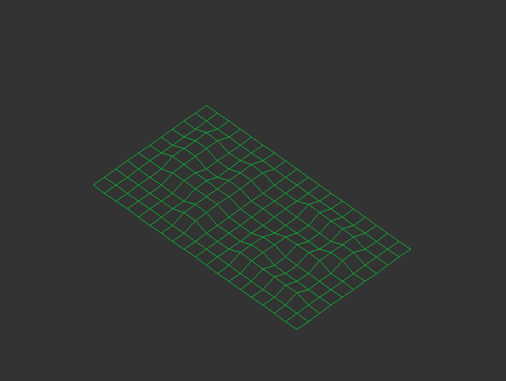
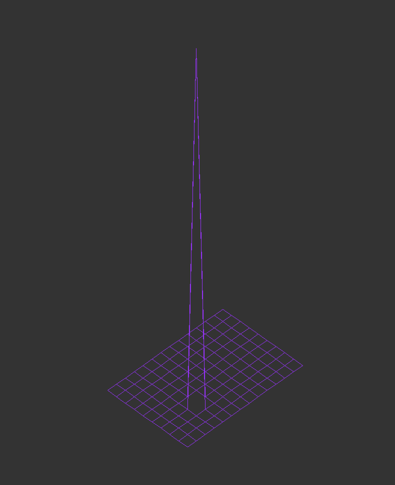

⋮⋮⋮⋮⋮⋮⋮⋮⋮⋮⋮⋮⋮⋮⋮⋮⋮⋮⋮⋮⋮⋮⋮⋮⋮⋮⋮⋮⋮⋮⋮⋮⋮⋮⋮⋮⋮⋮⋮⋮⋮⋮⋮⋮⋮⋮⋮⋮⋮⋮⋮⋮⋮⋮⋮⋮⋮⋮⋮⋮⋮⋮⋮⋮  
⋰⋰⋰⋰⋰⋰⋰⋰⋰⋰⋰⋰⋰⋰⋰⋰⋰⋰⋰⋰⋰⋰⋰⋰⋰⋰⋰⋰  
∷∷∷∷∷∷∷∷∷∷∷∷∷∷∷∷∷∷∷∷∷∷∷∷∷∷∷∷∷∷∷∷∷∷∷∷∷∷∷∷∷∷∷∷  
                 wireframe models              
∷∷∷∷∷∷∷∷∷∷∷∷∷∷∷∷∷∷∷∷∷∷∷∷∷∷∷∷∷∷∷∷∷∷∷∷∷∷∷∷∷∷∷∷  
⋰⋰⋰⋰⋰⋰⋰⋰⋰⋰⋰⋰⋰⋰⋰⋰⋰⋰⋰⋰⋰⋰⋰⋰⋰⋰⋰⋰  
⋮⋮⋮⋮⋮⋮⋮⋮⋮⋮⋮⋮⋮⋮⋮⋮⋮⋮⋮⋮⋮⋮⋮⋮⋮⋮⋮⋮⋮⋮⋮⋮⋮⋮⋮⋮⋮⋮⋮⋮⋮⋮⋮⋮⋮⋮⋮⋮⋮⋮⋮⋮⋮⋮⋮⋮⋮⋮⋮⋮⋮⋮⋮⋮  

 
# Subject 
- Your program has to display the image in a window.  
- The management of your window must remain smooth  
(changing to another window, minimizing, and so forth).  
- Pressing ESC must close the window and quit the program in a clean way.  
- Clicking on the cross on the window’s frame must close the window  
and quit the program in a clean way.  
  
  
# Math 
Isometric projection is a method for visually representing three-dimensional  
objects in two dimensions in technical and engineering drawings. It is an   
axonometric projection in which the three coordinate axes appear equally   
foreshortened and the angle between any two of them is 120 degrees.  
The term "isometric" comes from the Greek for "equal measure",   
reflecting that the scale along each axis of the projection is the same.  
True isometric projection uses a 30° angle (0.523599 rad).  

Representative Scale (RF) = iso length / true length  
RF = cos(45)/cos(30)  
So, iso lengths = 0.82 x true lengths  

  𝑥′=𝑥cos(𝜃)−𝑦sin(𝜃)  
  𝑦′=𝑥sin(𝜃)+𝑦cos(𝜃)

# Code 
1. Adding spaces between data points  
2. Rotating the grid around the z-axis by 45 degrees. 
3. Rotating the grid around the vertical axis by 45 degrees. 
4. Centering the map  
  